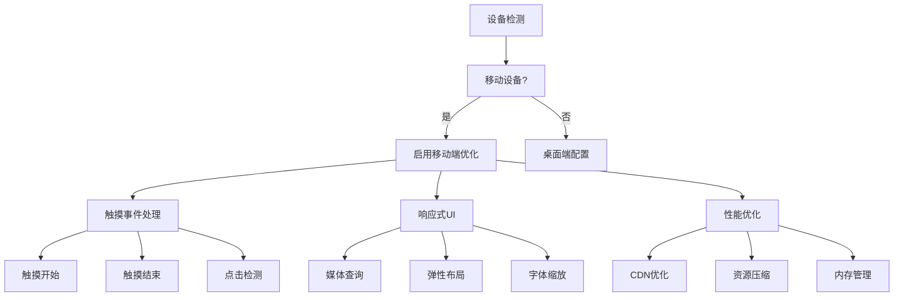

# AR.js 移动端适配说明

## 📱 移动端优化特性

### 1. 响应式设计
- **自适应布局**: 支持不同屏幕尺寸的设备
- **横屏优化**: 针对横屏模式优化UI布局
- **触摸友好**: 大按钮和清晰的交互区域

### 2. 性能优化
- **CDN优化**: 使用压缩版本的库文件
- **加载优化**: 智能CDN切换和错误处理
- **内存管理**: 及时释放摄像头资源

### 3. 交互体验
- **触摸支持**: 完整的触摸事件处理
- **手势识别**: 区分点击和滑动操作
- **视觉反馈**: 点击动画和状态提示

### 4. 设备兼容性
- **iOS支持**: 针对Safari和Chrome优化
- **Android支持**: 兼容主流Android浏览器
- **权限管理**: 智能摄像头权限请求

## 🚀 使用方法

### 1. 测试设备兼容性
```bash
# 打开测试页面
mobile-test.html
```

### 2. 开始AR体验
```bash
# 打开优化版AR页面
index-stable.html
```

### 3. 离线使用
```bash
# 下载资源后使用离线版本
index-offline.html
```

## 📋 技术实现

### 移动端适配要点



### 核心功能模块

#### 1. 设备检测
```javascript
const isMobile = /Android|webOS|iPhone|iPad|iPod|BlackBerry|IEMobile|Opera Mini/i.test(navigator.userAgent);
const isIOS = /iPad|iPhone|iPod/.test(navigator.userAgent);
const isAndroid = /Android/.test(navigator.userAgent);
```

#### 2. 触摸交互
```javascript
// 触摸事件处理
scene.addEventListener('touchstart', handleTouchStart);
scene.addEventListener('touchend', handleTouchEnd);

// 点击检测
function handleClick(event) {
    const intersectedElement = event.detail.intersectedEl;
    if (intersectedElement && intersectedElement.classList.contains('clickable')) {
        // 处理点击逻辑
    }
}
```

#### 3. 权限管理
```javascript
async function checkCameraPermission() {
    try {
        const stream = await navigator.mediaDevices.getUserMedia({ video: true });
        stream.getTracks().forEach(track => track.stop());
        return true;
    } catch (error) {
        return false;
    }
}
```

## 🎯 测试用例

### 测试场景
1. **iPhone Safari**: 主要测试场景
2. **Android Chrome**: 兼容性测试
3. **iPad Safari**: 平板设备测试
4. **桌面Chrome**: 对比测试

### 预期结果
- ✅ 摄像头权限正常获取
- ✅ AR场景正常加载
- ✅ 触摸交互响应正常
- ✅ UI布局适配良好
- ✅ 性能表现流畅

## 🔧 故障排除

### 常见问题

#### 1. 摄像头无法访问
**症状**: 提示摄像头权限错误
**解决**: 
- 检查浏览器权限设置
- 确保使用HTTPS协议
- 尝试刷新页面重新授权

#### 2. AR场景加载失败
**症状**: 页面显示加载错误
**解决**:
- 检查网络连接
- 尝试使用不同CDN
- 清除浏览器缓存

#### 3. 触摸交互无响应
**症状**: 点击AR物体无反应
**解决**:
- 确保设备支持触摸事件
- 检查JavaScript控制台错误
- 尝试重新加载页面

#### 4. 性能问题
**症状**: 画面卡顿或延迟
**解决**:
- 关闭其他应用释放内存
- 降低摄像头分辨率
- 使用性能更好的设备

#### 5. 视频宽高异常 ⭐
**症状**: AR视频显示异常，尺寸不正确
**解决**:
- 使用 `video-test.html` 测试摄像头
- 点击"🎥 调试"按钮查看详细信息
- 尝试不同的分辨率设置
- 检查设备像素比和屏幕尺寸
- 使用"🔧 修复尺寸"功能

## 📊 性能指标

### 目标性能
- **加载时间**: < 3秒
- **帧率**: > 30fps
- **内存使用**: < 100MB
- **电池消耗**: 优化到最低

### 监控指标
- 页面加载时间
- AR场景初始化时间
- 触摸响应延迟
- 内存使用情况

## 🔄 更新日志

### v2.0.0 (移动端优化版)
- ✨ 新增移动端适配
- ✨ 优化触摸交互
- ✨ 改进UI响应式设计
- ✨ 增强错误处理
- ✨ 添加设备检测功能

### v1.0.0 (基础版)
- 🎉 初始版本发布
- 🎉 基础AR功能
- 🎉 Hiro Marker支持

## 📞 技术支持

如有问题或建议，请：
1. 查看故障排除部分
2. 运行设备兼容性测试
3. 检查浏览器控制台错误
4. 联系技术支持团队

---

**注意**: 本版本专门针对移动端进行了优化，建议在移动设备上使用以获得最佳体验。
